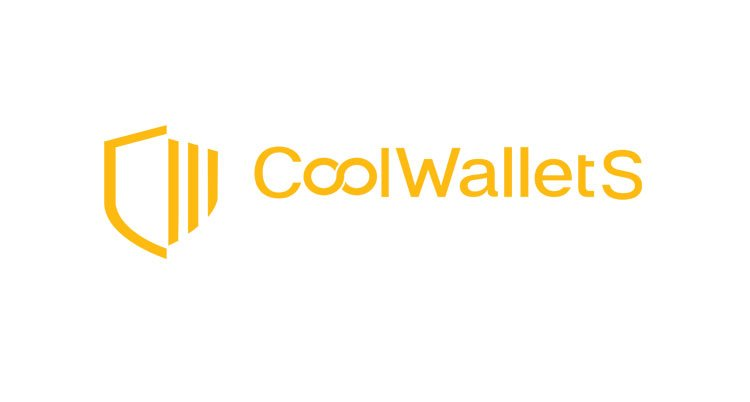

# CoolWalletS Javascript SDK

 
 JavaScript SDK to communicate with CoolWalletS. 
 
  

This is the monorepo of all the packages you need to build your own app with CoolWalletS hardware wallet.

## Packages

### Transport

To communicate with CoolWalletS device, you need to specify a bluetooth transport.

| Package |   Version   |   Description   |
| -- | -- |--|
|[`@coolwallets/transport-web-ble`](/packages/transport-web-ble) |  | Web Bluetooth support   |

### Core

Use this package for device registration, wallet creation, and other settings.

| Package |   Version   |   Description   |
| -- | -- |--|
|[`@coolwallets/sdk-core`](/packages/transport-web-ble) |  | Core functionalities    |

### Coin Apps

Used to sign transactions of different cryptocurrencies.

Currently supported coins: BTC, ETH, BNB, EOS, XLM, XRP, ZEN. Open an issue if you want the sdk of any one of them to come out first.

| Package | Version | Description |
| -------- | -------- | -------- |
| [`@coolwallets/eth`](/packages/cws-eth) |   |  Ethereum Application API  |
