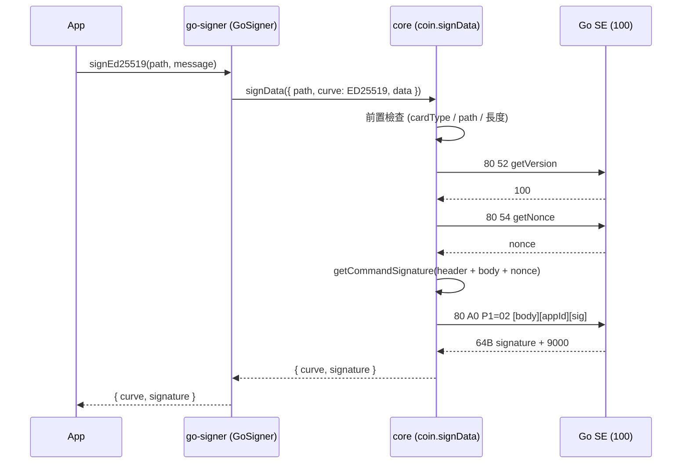
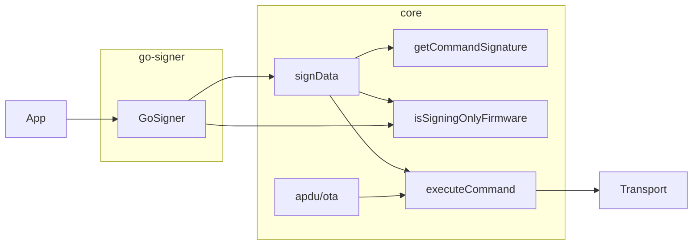

# Plan: Go 卡盲簽 — core 通用簽章函數 + `@coolwallet/go-signer`

> 🔨 In progress — PR 1 + PR 3 + PR 4 在 `feat/CW-29371-go-blind-sign`（#1225）；PR 2 在 `feat/CW-29371-go-signer`（見 decisions log）

## 1. Goal

在 core 新增通用簽章函數 `coin.signData`，透過 Go 卡簽章專用韌體（`getVersion` ≥ `100`）的 `INS 0xA0` 簽 ECDSA / Ed25519 / Bip32Ed25519 / Schnorr，並統一回傳多種簽章格式；新增 `@coolwallet/go-signer` 在 core 之上提供給 App 的簽章 API；修正 OTA 不檢查回應碼的問題並支援新韌體 OTA。

**成功標準**：四種曲線在新韌體（host-sim 與實卡）上簽出的簽章可用對應公鑰驗證通過；ECDSA / Ed25519 為確定性簽章，與參考實作逐 byte 一致；go-signer 有單元測試；OTA 的 LOAD / INSTALL 回非 `9000` 時明確失敗。

## 2. Context

Go 卡改為盲簽：SE（coolwallet-lite-se `a9ccb8d`、`89154b4`、`76c71d4`）拿掉 script interpreter，改以 `80 A0 P1=signType P2=00` 直接簽外部準備好的 digest / message，`getVersion`（十進位）≥ `100` 代表簽章專用卡、< `100` 為 script 卡（lite-se `ea894b3`）。組交易移到 App，SDK 只負責「怎麼請卡片簽」。沒有這個 API，App 無法在新韌體上簽任何東西（舊 coin-* package 的 script 指令會得到 `6D00`）。

### SE 介面摘要（INS 0xA0）

| 項目 | 內容 |
|---|---|
| APDU | `CLA=80 INS=A0 P1=signType P2=00` |
| data | `[pathLength 1B][path][signData]` + `appId 20B` + `signature 72B`（同 `getCommandSignature`，需先 `getNonce`） |
| signType | `01` secp256k1、`02` ed25519、`03` bip32-ed25519、`04` curve25519、`05` schnorr |
| keyType 對應 | secp256k1↔`32`；schnorr↔`34`(BIP-86, tweak) 或 `32`；ed25519↔`10`/`42`；bip32-ed25519↔`17`；不符回 `6A86` |
| signData 長度 | ECDSA / Schnorr 必須 32B digest；EdDSA 為原始訊息、非空；否則 `6700` |
| 前置條件 | `WALLET_CREATED`；command signature 驗證失敗 `609C`~`609F` |
| 回應 | 明文簽章：ECDSA 為 strict DER、low-S、無 recovery id；EdDSA / Schnorr 64B |

## 3. Scope

### In scope

- [x] core：`SIGN_DATA` command 定義與 `coin.signData`（0xA0 路徑）
- [x] core：韌體版本判斷（`seVersion >= 100` 視為簽章專用韌體），非簽章專用韌體呼叫 `signData` 明確丟錯
- [x] core：統一回傳格式（ECDSA 同時回 `der` 與 canonical `{ r, s }`；EdDSA / Schnorr 回 64B）
- [x] go-signer：新 package，包 core `signData` 為各曲線方法，結果原樣透傳
- [x] core：`insertLoadScript` / `insertScript` 檢查回應碼，非 `9000` 丟錯
- [x] core：Go OTA 切換為新韌體 loadScript 與版本號

### Out of scope (explicit)

- [ ] 各鏈 adapter（ethers Signer、bitcoinjs Signer、Solana、Cosmos…）
- [ ] 修改既有 coin-* package 以支援新韌體
- [ ] curve25519（卡片支援 signType `04`，但票未要求）
- [ ] App 端組交易 / 解析交易

### Deferred

- [ ] 舊韌體（Go SE 13 / 16，script 卡）的通用 script 路徑：Ed25519 / Bip32Ed25519 / Schnorr 新 script 走 `coolwallet-signing-tools` 簽，`signData` 依版本自動切換。使用者指示先不處理。
- [ ] go-signer `getPublicKey(path)` / xpub 快取、ECDSA recovery id 自動計算（需公鑰，見 §9）
- [ ] 舊 coin-* package 在新韌體上收到 `6D00` 時的友善錯誤訊息
- [ ] `signBatch`（BTC 多輸入目前以迴圈逐筆呼叫即可）

## 4. Approach

### 4.1 core（`packages/core`）

- `src/apdu/execute/command.ts`：新增
  `SIGN_DATA: { CLA: '80', INS: 'A0', P1: undefined, P2: '00' }`
- `src/coin/signData.ts`（新檔）：

  ```ts
  enum SignCurve { SECP256K1 = '01', ED25519 = '02', BIP32ED25519 = '03', SCHNORR = '05' }

  type SignDataParams = {
    transport: Transport;
    appId: string;
    appPrivateKey: string;
    path: string;        // 自訂 hex path：[pathType 1B][index 4B]...，同 utils.getFullPath 輸出
    curve: SignCurve;
    data: string;        // hex；ECDSA / Schnorr 為 32B digest，EdDSA 為原始訊息
  };

  type SignDataResult =
    | { curve: SignCurve.SECP256K1; der: string; r: string; s: string }
    | { curve: SignCurve.ED25519 | SignCurve.BIP32ED25519 | SignCurve.SCHNORR; signature: string }; // 64B hex
  ```

  流程：
  1. 前置檢查（host 端先擋，錯誤訊息比 SW 好懂）：`transport.cardType === Go`；path hex 合法且 ≤ 255B；pathType 與 curve 相容（同 SE 對照表）；data 長度規則。
  2. `info.getSEVersion` ≥ `100`，否則丟 `SDKError('signData', 'requires Go signing-only firmware')`。
  3. `body = pathLength + path + data`；`sig = getCommandSignature(transport, appId, appPrivateKey, SIGN_DATA, body, curve, '00')`。
  4. `executeCommand(transport, SIGN_DATA, target.SE, body + sig, curve, '00')`；非 `9000` 丟 `APDUError`。
  5. 依 curve 組裝結果：ECDSA 解析 DER 得 `r`、`s`（64 hex 補零）並保留原始 `der`；其他直接回 64B hex。
- `src/coin/index.ts`：export `signData`、`SignCurve` 及型別。
- 版本判斷抽成 `src/info` 下的小 helper（例如 `isSigningOnlyFirmware(transport)`），供 go-signer 與日後 OTA 判斷共用。

### 4.2 go-signer（`packages/go-signer`）

結構比照 `coin-template`（babel + tsc + jest），`@coolwallet/core` 為 peerDependency（開發期 devDependency 指向 `file:../core`）。

```
packages/go-signer/
├── package.json
├── tsconfig.json
├── .babelrc
├── README.md
├── src/
│   ├── index.ts          # export GoSigner、型別
│   ├── GoSigner.ts       # class 本體
│   └── types.ts          # GoSignerOptions、re-export core 的 SignCurve / SignDataResult
└── tests/
    └── GoSigner.spec.ts
```

```ts
class GoSigner {
  constructor(transport: Transport, options: { appId: string; appPrivateKey: string });
  isSupported(): Promise<boolean>;                         // 韌體是否為簽章專用
  signSecp256k1(path: string, digest: string): Promise<EcdsaResult>;
  signSchnorr(path: string, digest: string): Promise<SchnorrResult>;
  signEd25519(path: string, message: string): Promise<EddsaResult>;
  signBip32Ed25519(path: string, message: string): Promise<EddsaResult>;
}
```

go-signer 不做格式轉換、不碰 APDU，只負責綁定 transport 與 app 金鑰、提供各曲線的明確入口與型別收斂。

### 4.3 OTA

- `src/apdu/ota/scripts.ts`：`insertScript`、`insertLoadScript` 取得 `statusCode`，非 `9000` 丟 `APDUError`（比照 `insertDeleteScript` 已有的寫法）。
- `src/apdu/ota/constants.ts`：`SE_UPDATE_VER_GO` 改為 `100`；`src/apdu/script/go/otaScript.ts` 換成 CW-29370 交付的新韌體 loadScript。

## 5. Alternatives considered

### Alternative A：擴充既有 `ECDSACoin.signTxHash`
- **What**：在 `SignTxHashData` 加 curve、data 欄位，讓 `signTxHash` 兼做四種曲線。
- **Why not**：`signTxHash` 綁定 coinType 與 `addressIndex`/`purpose`，無法表達任意 path；EdDSA 掛在 `ECDSACoin` 上語意錯誤。使用者選擇獨立函數。

### Alternative B：core 回卡片原始輸出，格式轉換放在 go-signer
- **What**：`signData` 只回 hex，DER 解析等交給 go-signer。
- **Why not**：使用者決定由 core 統一回傳多種格式，go-signer 單純接收；日後舊韌體 script 路徑（輸出格式不同）也能在 core 內收斂，上層無感。

### Alternative C：只做 go-signer，core 不動
- **What**：APDU 組裝全部寫在 go-signer。
- **Why not**：版本判斷、command 定義、OTA 本來就屬 core；日後 coin-* package 也可能直接用 `signData`，放 go-signer 會造成重複。

## 6. Diagrams

### 簽章流程



### 模組關係



## 7. PR Breakdown

### PR 1: core 通用簽章函數（0xA0 路徑）— ~200 lines
- **Category**: Feature
- **Branch**: `feat/CW-29371-go-blind-sign`
- **Goal**: core 提供 `coin.signData`，在簽章專用韌體上簽四種曲線並回傳統一格式。
- **Depends on**: none
- **Merge order**: 1st
- **Commits**:
  - [x] `feat(core): add SIGN_DATA command and signing-only firmware check`
  - [x] `feat(core): add coin.signData for Go signing-only firmware`
  - [x] `test(core): cover signData validation and result formatting`

---

### PR 2: 新增 `@coolwallet/go-signer` — ~180 lines
- **Category**: Feature
- **Branch**: `feat/CW-29371-go-signer`（從 `feat/CW-29371-go-blind-sign` 開出；PR base 先指向它，PR 1 merge 後改為 `master`）
- **Goal**: 新 package 以 `GoSigner` 包裝 core `signData`，提供給 App 的各曲線簽章 API。
- **Depends on**: PR 1（需要 core 發版含 `signData`）
- **Merge order**: 2nd
- **Commits**:
  - [x] `chore(go-signer): scaffold package`
  - [x] `feat(go-signer): add GoSigner with per-curve sign methods`
  - [ ] `test(go-signer): add unit tests with mocked core`

---

### PR 3: OTA 檢查 LOAD / INSTALL 回應碼 — ~40 lines
- **Category**: Bugs
- **Branch**: `feat/CW-29371-go-blind-sign`（併入 #1225）
- **Goal**: `insertScript` / `insertLoadScript` 遇到非 `9000` 時明確失敗。
- **Depends on**: none
- **Merge order**: 與 PR 1 一起（#1225），必須在新韌體 OTA 發版前上線
- **Commits**:
  - [x] `fix(core): fail OTA when load or install returns non-9000`
  - [x] `test(core): cover OTA status check`

---

### PR 4: Go OTA 支援簽章專用韌體 — loadScript 資料為主
- **Category**: Feature
- **Branch**: `feat/CW-29371-go-blind-sign`
- **Goal**: Go OTA 更新到 `100` 簽章專用韌體。
- **Depends on**: 新韌體 loadScript（使用者已提供）
- **Merge order**: 已先 commit（`e8beb8cf7`）
- **Commits**:
  - [x] `feat(core): update Go OTA to signing-only firmware 100 (CW-29371)`

## 8. Testing strategy

- **Unit tests（core，`packages/core/tests/coin/`）**：mock transport 驗證 APDU 組裝（P1、body、appId + sig 位置）；前置檢查（curve/pathType 不符、digest 非 32B、空訊息、path 過長）；版本 < `100` 丟錯；DER → `{ r, s }` 解析（含 r/s 前導 `00`、短於 32B 補零）；SW 非 `9000` 丟 `APDUError`。
- **Unit tests（go-signer）**：mock core `signData`，確認各方法帶對 curve、結果原樣透傳、`isSupported` 判斷。
- **Integration**：host-sim（coolwallet-lite-se `host-sim`）+ `transport-jre-http`，四種曲線簽完以公鑰驗證；ECDSA / Ed25519 與參考實作（elliptic / tweetnacl）逐 byte 比對。
- **Manual**：新韌體實卡跑同一組 integration；OTA 在實卡上故意中斷 / 給錯 script 確認會丟錯。
- **Not tested**：舊韌體 script 路徑（已延後）；BLE / NFC transport 本身。

## 9. Risks & open questions

- **Assumption**：新韌體的 SE trans key 與 `SE_KEY_PARAM.Go` 相同，register 不用改 — 若不同，PR 1 前需先補 `config` 的金鑰參數。
- **Assumption**：簽章專用韌體 `transport.cardType` 仍為 `CardType.Go`，以版本號區分 — 若需獨立 CardType，影響 transport 與 OTA 分派。
- **Assumption**：ECDSA 結果不含 recovery id（卡片不回、core 沒有公鑰）；需要的話由 App 或日後 go-signer 計算。
- **Assumption**：結果欄位一律為 hex string（不用 Buffer）。
- **Risk**：`executeAPDU` 限制 data（含 1B checksum）≤ 4096 hex，即 APDU data 最多 2047B；扣掉 appId + sig 92B 後 `[pathLength][path][signData]` 最多 1955B；需與 SE `largestMessage` 對齊，大型 SOL 交易可能超出 — mitigation：前置檢查給明確錯誤，必要時另開票支援分段。
- **Risk**：卡片無確認畫面，任何送進來的 digest 都會被簽 — mitigation：README 明確標示盲簽語意。
- **Risk**：go-signer 依賴的 core 版本需先發佈 — mitigation：PR 2 開發期用 `file:../core`，發佈前改為 `^<new core version>`。

## 10. Done criteria

- [ ] #1225（PR 1 + PR 3 + PR 4）merge → PR 2 merge
- [ ] CI 綠燈
- [ ] 四種曲線在 host-sim 與新韌體實卡上簽章可驗證
- [ ] ECDSA / Ed25519 與參考實作逐 byte 一致
- [ ] BTC 多輸入可連續呼叫 `signData` 簽完
- [x] OTA LOAD / INSTALL 非 `9000` 時明確失敗
- [ ] Go OTA 可更新到 `100`
- [ ] core CHANGELOG 與 go-signer README 更新

---

## Appendix: decisions log

- 2026-10-06 — core 新增獨立 `signData`，不擴充 `signTxHash` — 使用者選 (a)，`signTxHash` 綁 coinType。
- 2026-10-06 — 格式轉換由 core 統一處理，go-signer 透傳 — 使用者決定。
- 2026-10-06 — path 使用 SDK 自訂 hex 格式（`[pathType][index...]`）— 使用者決定。
- 2026-10-06 — 舊韌體（SE 13 / 16）script 路徑延後 — 使用者指示先不處理。
- 2026-10-06 — package 命名 `@coolwallet/go-signer` — 對齊產品名 CoolWallet Go。
- 2026-10-07 — 簽章專用韌體版本為十進位 `100`（非 `0x0100`），判斷改為 `seVersion >= 100` 且 `cardType === Go`（Pro 版本號 > 100，必須一併判斷卡別）— SE 已改版（lite-se `ea894b3`）。
- 2026-10-07 — 新韌體 OTA script（PR 4）與 PR 1 同在 `feat/CW-29371-go-blind-sign` — 使用者決定。
- 2026-10-07 — PR 2 另開 `feat/CW-29371-go-signer`，疊在 PR 1 分支上 — go-signer 為新 package，需等含 `signData` 的 core 發版；使用者同意。
- 2026-10-07 — PR 3（OTA 回應碼檢查）併入 #1225 — 新韌體整版替換，LOAD / INSTALL 失敗不可被當成成功；使用者決定。
- 2026-10-07 — OTA 推到 100 後舊 coin-* script 路徑在 Go 卡失效（`6D00`），由 App 端配合改走 `signData` / go-signer 後再發版 — 使用者確認。
